## \***\*App 컨테이너 Image를 Build하세요\*\***

```docker
# syntax=docker/dockerfile:1
FROM node:14-alpine
RUN apk add --no-cache python2 g++ make
WORKDIR /app
COPY . .
RUN yarn install --production
CMD ["node", "src/index.js"]
EXPOSE 3000
```

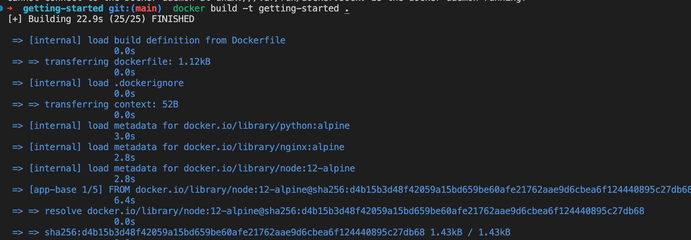

```docker
docker build -t getting-started .

```

## App Start

```docker
docker run -dp 3000:3000 getting-started
```

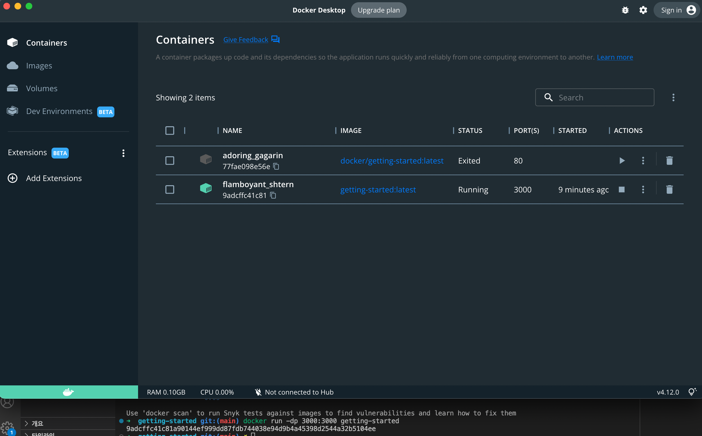

```jsx
➜  getting-started git:(main) ✗ docker scan
Docker Scan relies upon access to Snyk, a third party provider, do you consent to proceed using Snyk? (y/N)
y
Usage:  docker scan [OPTIONS] IMAGE

A tool to scan your images

Options:
      --accept-license    Accept using a third party scanning provider
      --dependency-tree   Show dependency tree with scan results
      --exclude-base      Exclude base image from vulnerability scanning (requires --file)
  -f, --file string       Dockerfile associated with image, provides more detailed results
      --group-issues      Aggregate duplicated vulnerabilities and group them to a single one (requires --json)
      --json              Output results in JSON format
      --login             Authenticate to the scan provider using an optional token (with --token), or web base token if empty
      --reject-license    Reject using a third party scanning provider
      --severity string   Only report vulnerabilities of provided level or higher (low|medium|high)
      --token string      Authentication token to login to the third party scanning provider
      --version           Display version of the scan plugin
"docker scan" requires exactly 1 argument
```

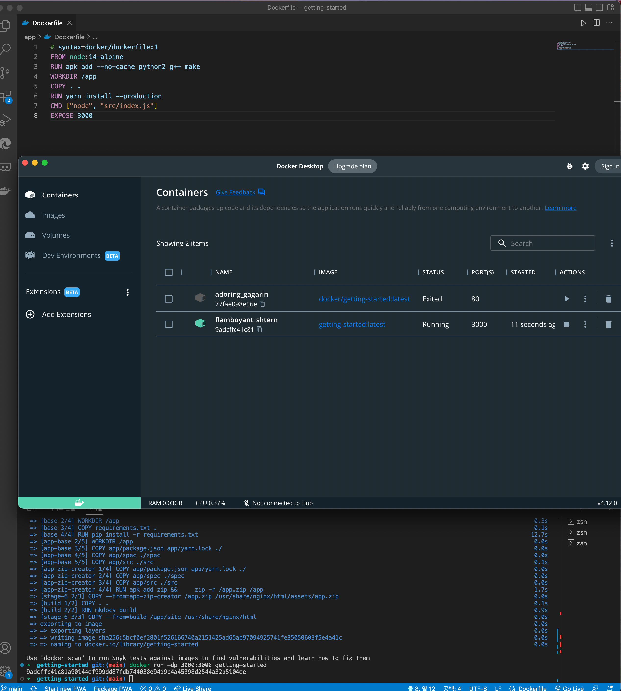

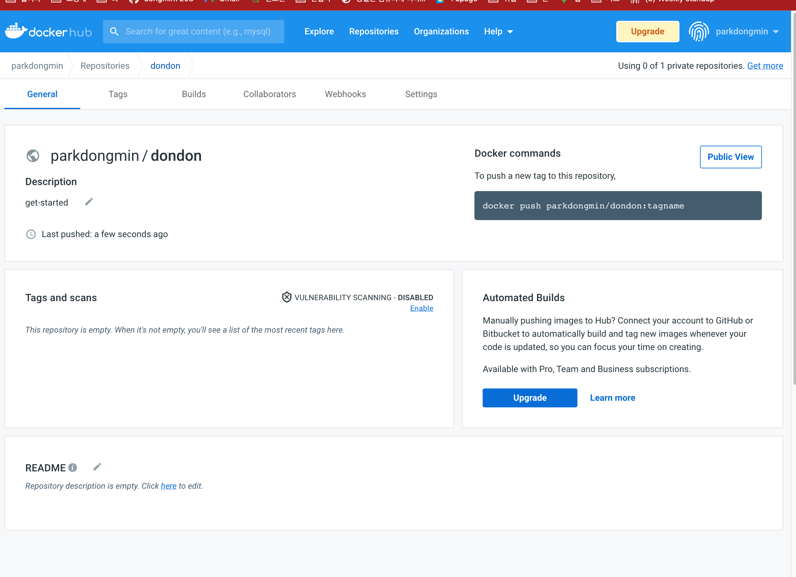

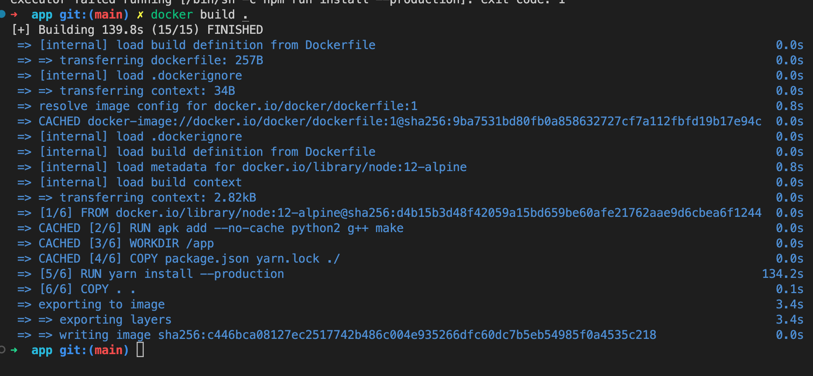

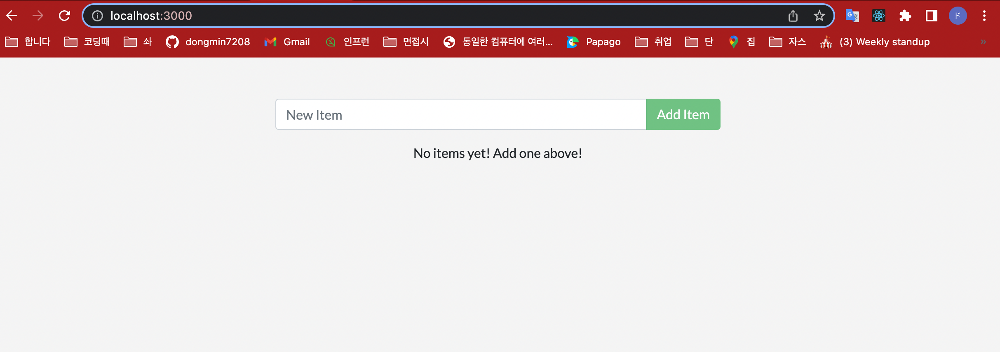

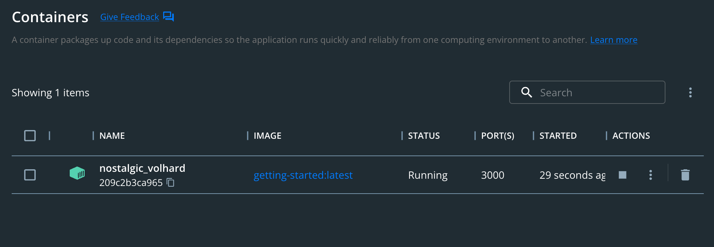

## Part 5:\***\*Persist the DB\*\***

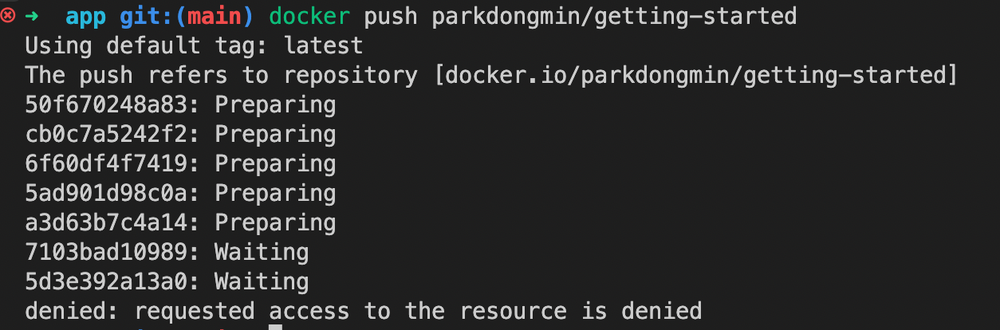

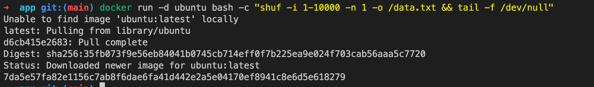

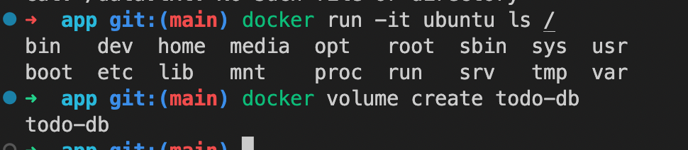

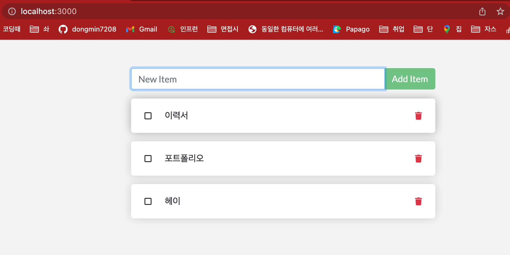

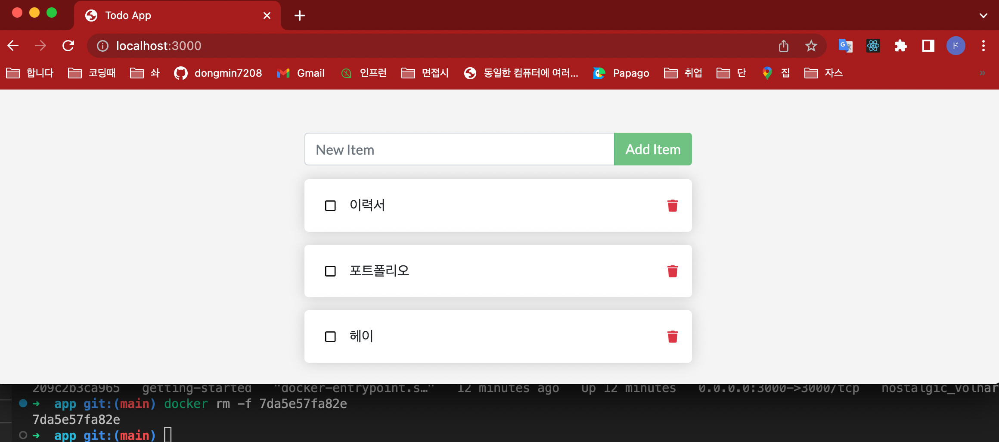

## Part 7:\***\*Multi container apps\*\***

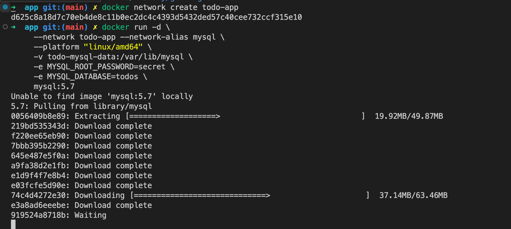

## Part 8:\***\*Use Docker Compose\*\***

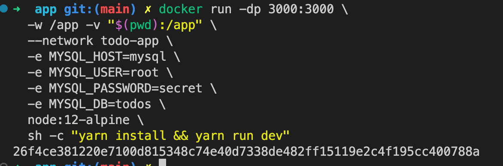

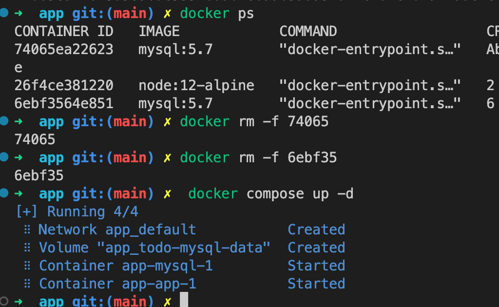

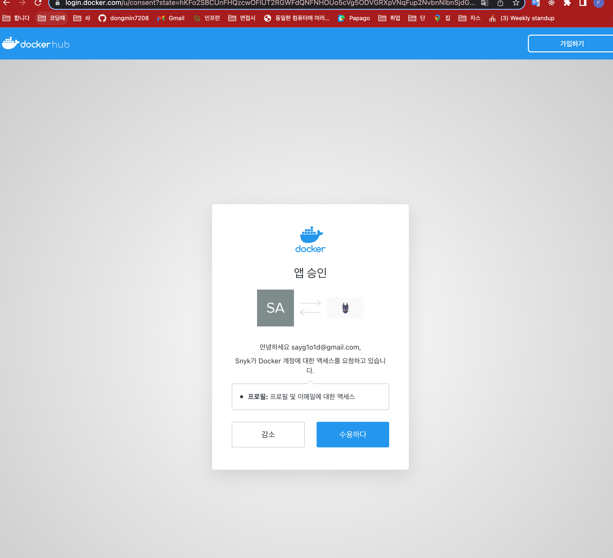

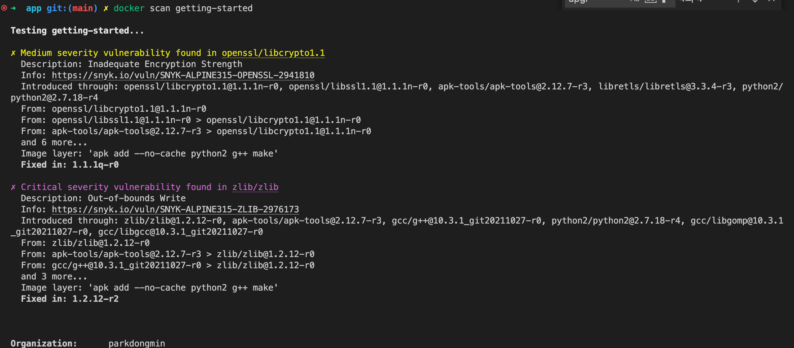

## Part 9:\***\*Image-building best practices\*\***

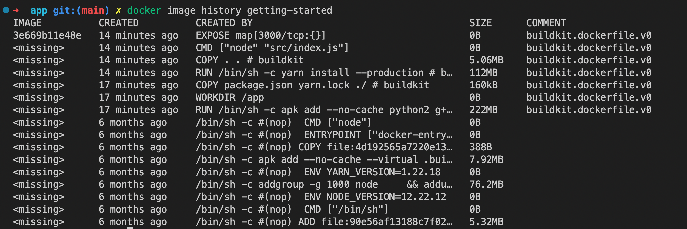

# Docker Getting Started Tutorial

This tutorial has been written with the intent of helping folks get up and running
with containers and is designed to work with Docker Desktop. While not going too much
into depth, it covers the following topics:

-   Running your first container
-   Building containers
-   Learning what containers are running and removing them
-   Using volumes to persist data
-   Using bind mounts to support development
-   Using container networking to support multi-container applications
-   Using Docker Compose to simplify the definition and sharing of applications
-   Using image layer caching to speed up builds and reduce push/pull size
-   Using multi-stage builds to separate build-time and runtime dependencies

## Getting Started

If you wish to run the tutorial, you can use the following command after installing Docker Desktop:

```bash
docker run -d -p 80:80 docker/getting-started
```

Once it has started, you can open your browser to [http://localhost](/getting-started/app/src/img/1.png)

## Development

This project has a `docker-compose.yml` file, which will start the mkdocs application on your
local machine and help you see changes instantly.

```bash
docker-compose up
```

## Contributing

If you find typos or other issues with the tutorial, feel free to create a PR and suggest fixes!

If you have ideas on how to make the tutorial better or new content, please open an issue first before working on your idea. While we love input, we want to keep the tutorial scoped to newcomers.
As such, we may reject ideas for more advanced requests and don't want you to lose any work you might
have done. So, ask first and we'll gladly hear your thoughts!
